# HPE ProLiant MicroServer Gen10 & Gen10 Plus Fan Policy Proxy

[English Document](./README.enUS.md)

This project uses Arduino to proxy PWM signals to support Noctua and other low-speed silent fans for the HPE ProLiant MicroServer Gen10 & Gen10 Plus server model. It also supports using a second fan interface to cool the iLO chip.

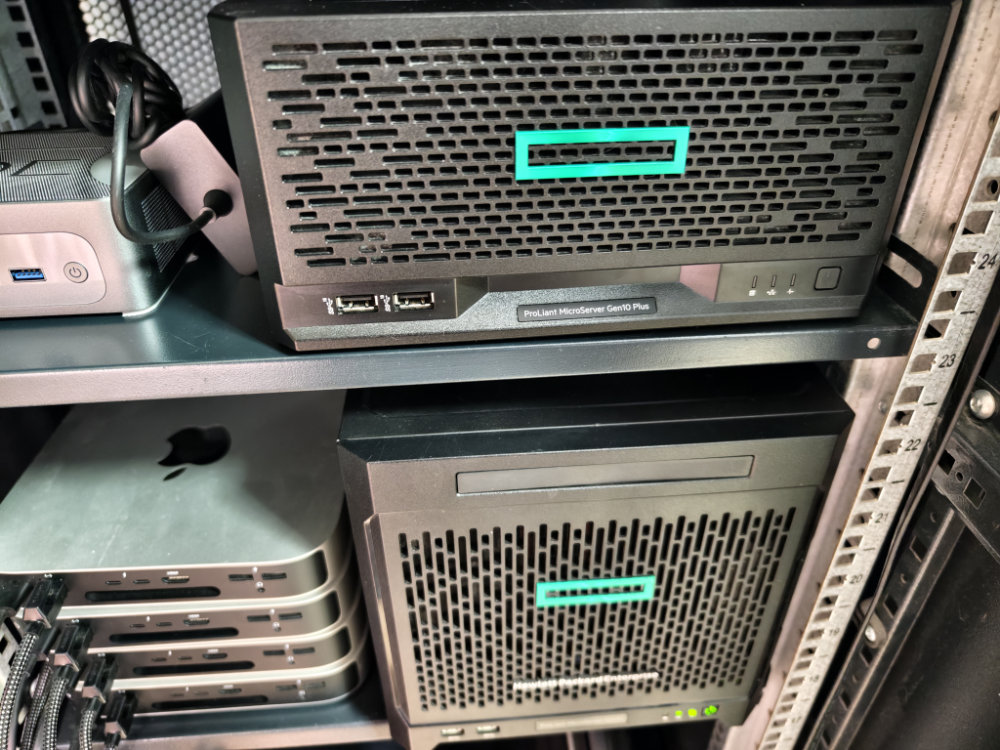

## Complete Tutorial

- [Home 10GbE Network Practice: Compact Home Server Noise Reduction Modification (Part 2)](https://zhuanlan.zhihu.com/p/16505126621)
- [Home network upgrade practice: Quiet local 10G networking (Part 3)](https://zhuanlan.zhihu.com/p/16965372145)

## Hardware Related

Fan interface connector pin definitions from [Max-Sum/HP-fan-proxy](https://github.com/Max-Sum/HP-fan-proxy).

### Components

Recommended components from the [zhaoyingpu/hpe-gen10-fan-proxy](https://github.com/zhaoyingpu/hpe-gen10-fan-proxy) project.

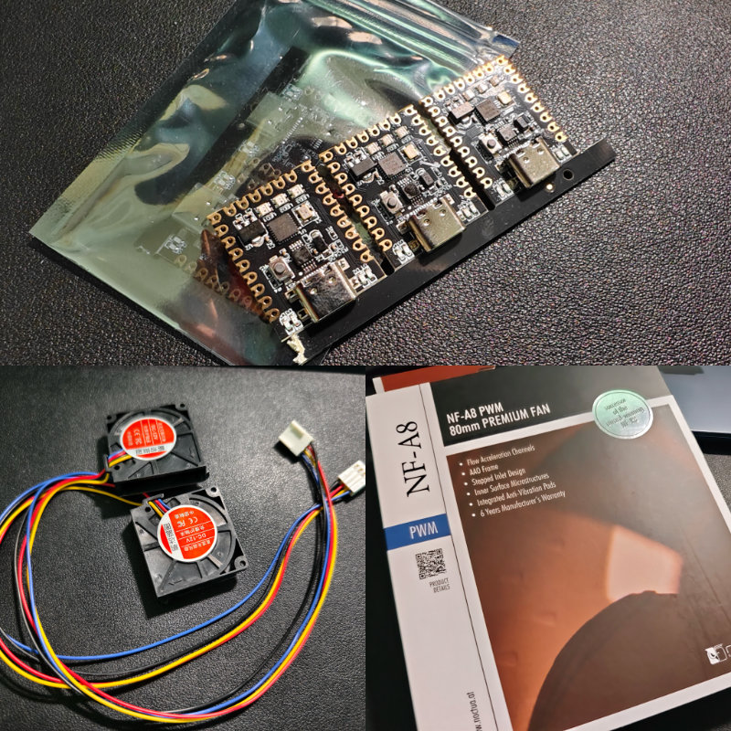

**2x3 PHDS2.0, Hongxing Electronics HX20017**: [taobao link](https://m.tb.cn/h.gZnKOee5pgJFSKW)

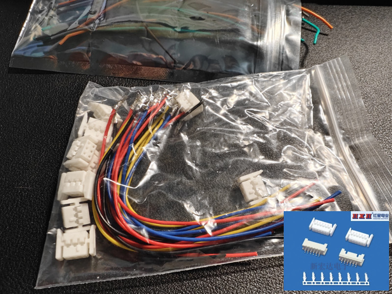

**Arduino Nano Mini**: [taobao link](https://m.tb.cn/h.gZMNWzPMlKCnLvb)

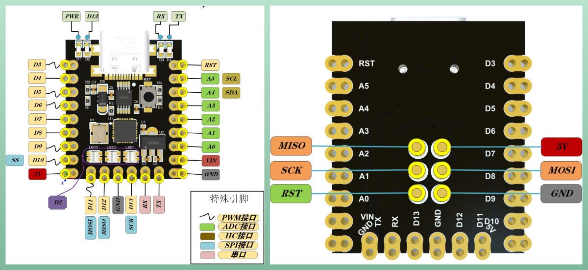

**Case Fan: Noctua NF-A8**

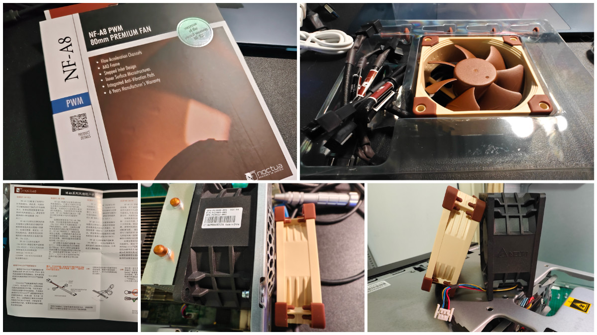

**Turbo Fan 4010**: [taobao link](https://m.tb.cn/h.g01uqRhDhxVOKu0)

## Software Related

### Chip Verification Program

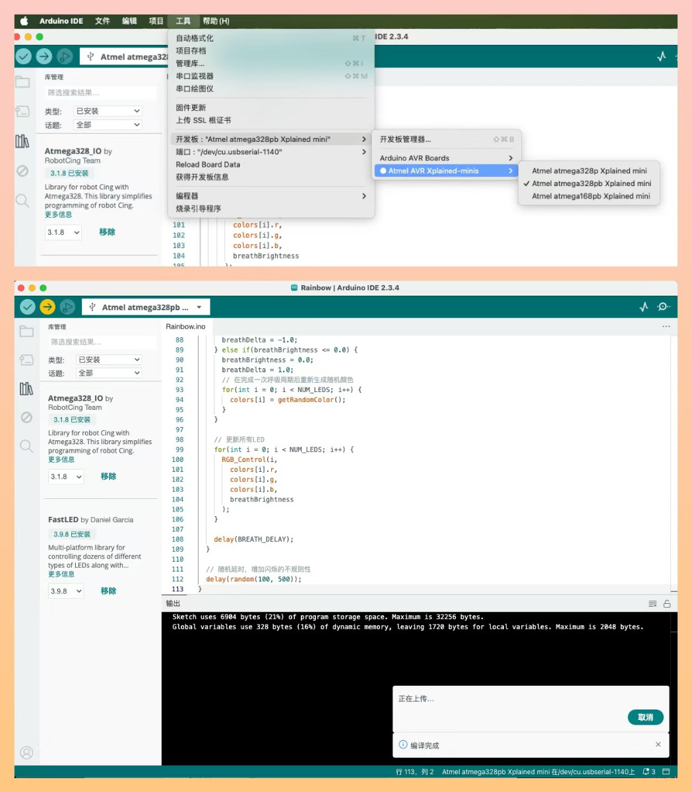

To ensure you can correctly flash the fan control policy, you can use the LED test program below to verify your development environment and development board.

Detailed implementation: [arduino-test](./arduino-test.ino)

### Fan Policy Control Section

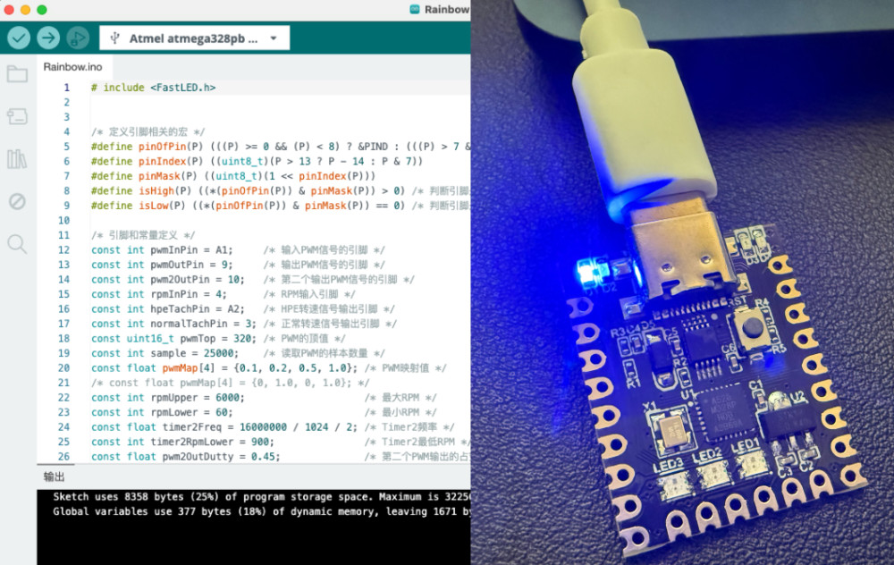

The following is sourced from [zhaoyingpu/hpe-gen10-fan-proxy](https://github.com/zhaoyingpu/hpe-gen10-fan-proxy), improved from [Max-Sum/HP-fan-proxy/blob/master/hp_fan.ino](https://github.com/Max-Sum/HP-fan-proxy/blob/master/hp_fan.ino).

The RPM converter generates corresponding RPM pulse signals (2 pulses per revolution) based on HPE's input signal. It uses delay when RPM is less than 900, otherwise uses PWM output. This function is not actually used by HPE, which only needs a pull-down signal to confirm fan presence.

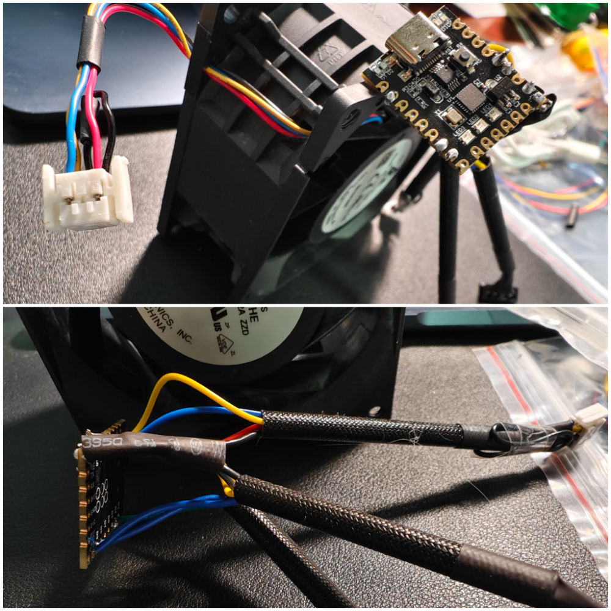

The HPE fan is rated at 6100 RPM, while the Noctua NF-A8 PWM runs at 2200 RPM, with 1/3 airflow (55.5 vs 146.88 m³/h) and 1/10 static pressure (2.37 vs 22.8 mm H2O). Therefore, I mapped the duty cycle from 0.1-0.2 to 0.5-1.0. The minimum duty cycle is 0.5.

Detailed implementation: [fan-proxy](./fan-proxy.ino)

## Final Product

Below is zhaoyingpu's original elegant design:

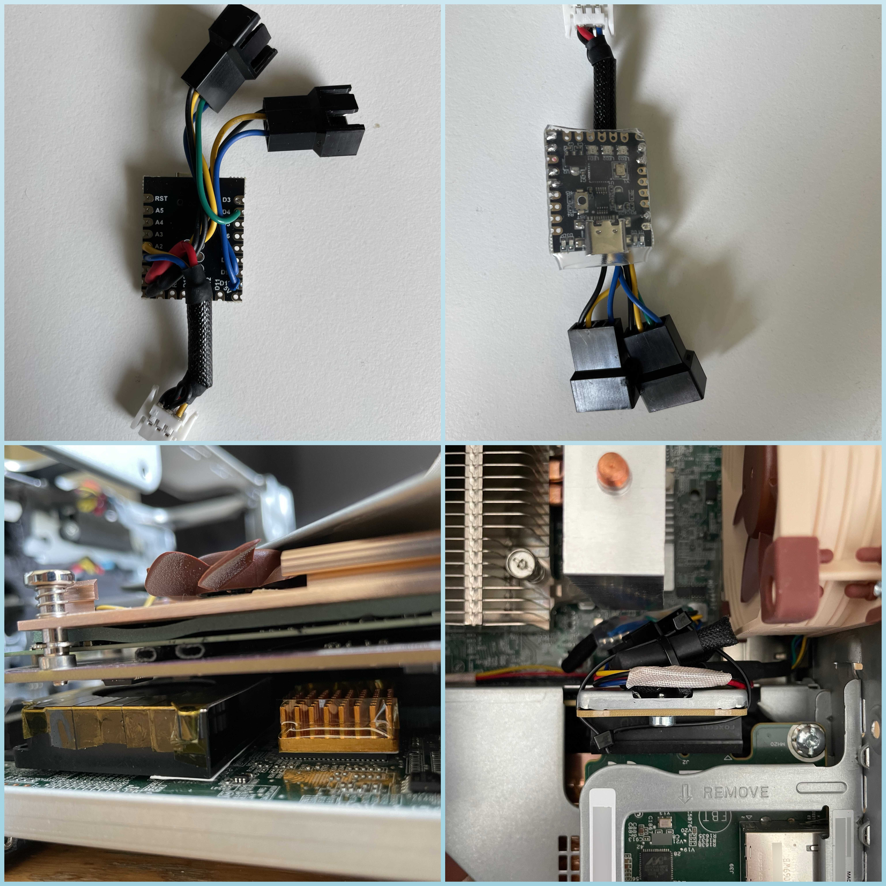

And this project's reproduction:

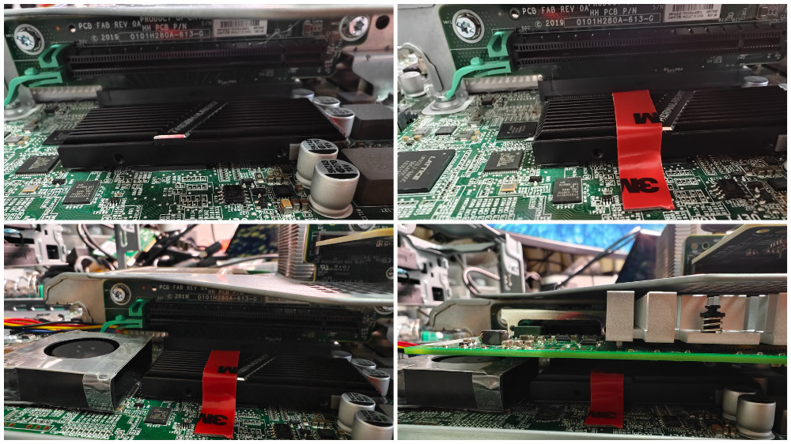

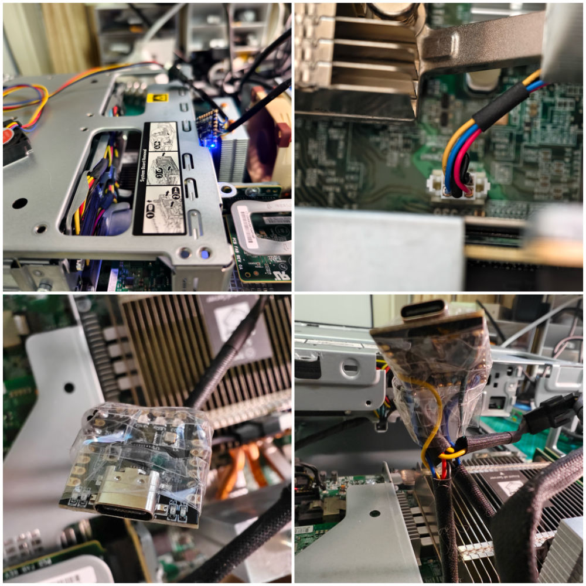

## Acknowledgments

Server noise reduction wouldn't have been this smooth without these excellent projects:

- 2024, [zhaoyingpu/hpe-gen10-fan-proxy](https://github.com/zhaoyingpu/hpe-gen10-fan-proxy)
- 2020, [Max-Sum/HP-fan-proxy](https://github.com/Max-Sum/HP-fan-proxy)
- 2019, [Solving the DL180 G6 Fan Controller Problem](https://www.chamberofunderstanding.co.uk/2019/02/16/solving-the-dl180-g6-fan-controller-problem)
- 2017, [executivul](https://www.reddit.com/user/executivul/), [Code](https://pastebin.com/DuZERF56)
- [HP DL380e G8 arduino fan control project](https://www.reddit.com/r/homelab/comments/7vxo5n/hp_dl380e_g8_arduino_fan_control_project/)
- [Faking the fan signal on a DL380 G7](https://www.reddit.com/r/homelab/comments/72k3jf/faking_the_fan_signal_on_a_dl380_g7/)