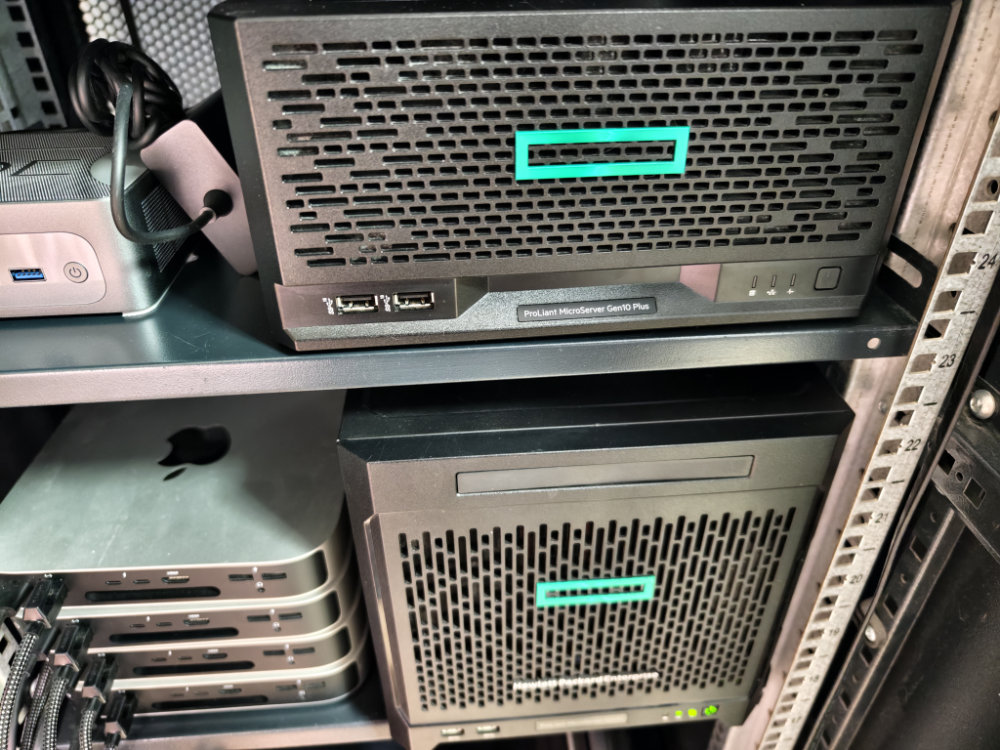
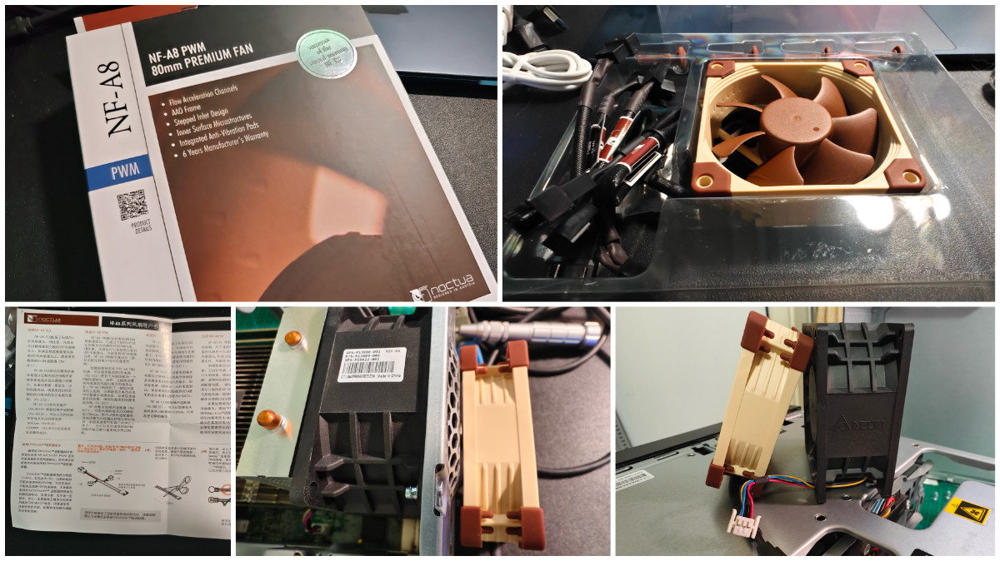
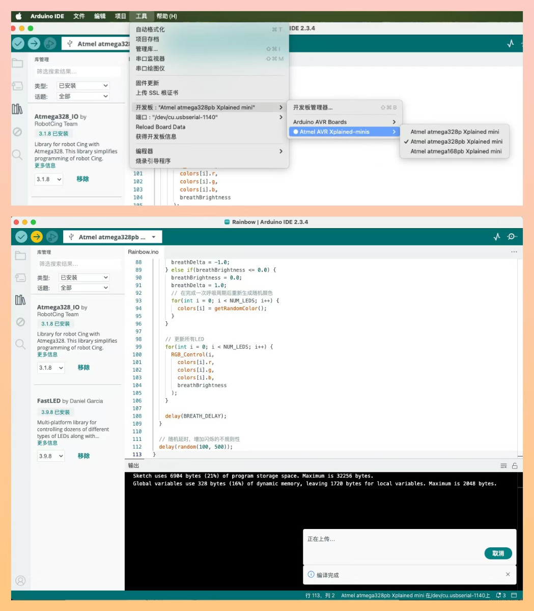
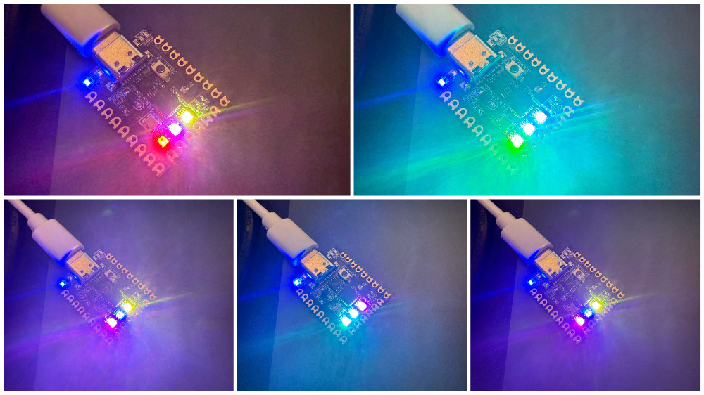
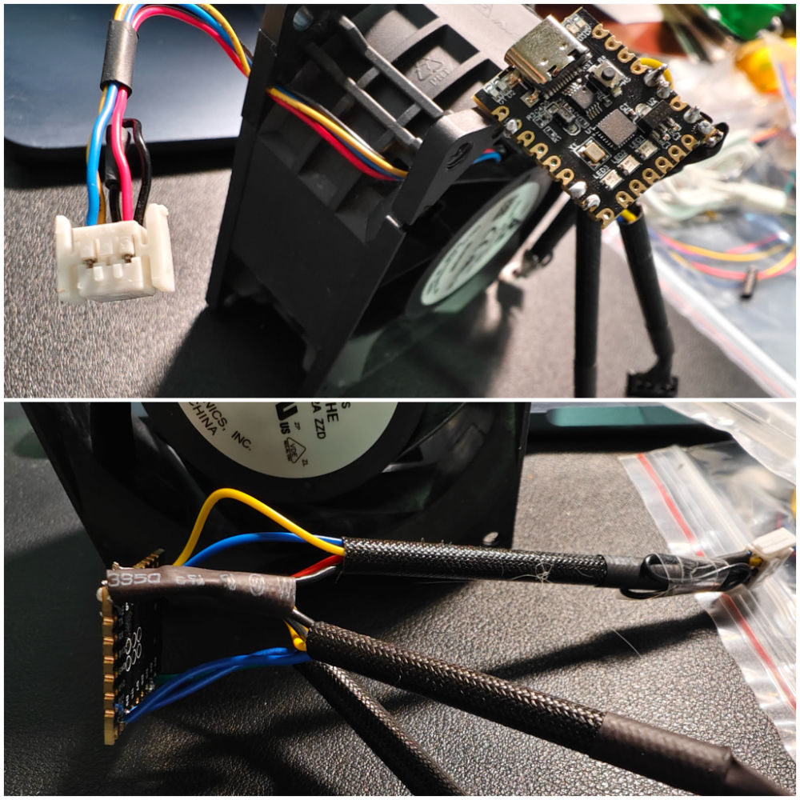

# HPE ProLiant MicroServer Gen10 & Gen10 Plus 服务器风扇策略代理

[English Document](./README.enUS.md)

这个项目使用 Arduino 代理 PWM 信号来支持猫头鹰和其他低速静音风扇，服务器型号是 HPE ProLiant MicroServer Gen10 & Gen10 Plus，支持使用第二个风扇接口来冷却 iLO 芯片。

## 完整教程

- [家用万兆网络实践：紧凑型家用服务器静音化改造（二）](https://zhuanlan.zhihu.com/p/16505126621)
- [家用网络升级实践：安静的局部万兆组网（三）](https://zhuanlan.zhihu.com/p/16965372145)

## 硬件相关

来自 [Max-Sum/HP-fan-proxy](https://github.com/Max-Sum/HP-fan-proxy) 的风扇接口连接器引脚定义。

### 配件

来自 [zhaoyingpu/hpe-gen10-fan-proxy](https://github.com/zhaoyingpu/hpe-gen10-fan-proxy) 项目推荐的配件。

**2x3 PHDS2.0, 红星电业 HX20017**：[taobao link](https://m.tb.cn/h.gZnKOee5pgJFSKW) 

**Arduino Nano Mini**：[taobao link](https://m.tb.cn/h.gZMNWzPMlKCnLvb) 

**机箱风扇：猫头鹰 NF- A8**

**涡轮风扇 4010**：[taobao link](https://m.tb.cn/h.g01uqRhDhxVOKu0) 

## 软件相关

### 芯片验证程序

为了确保你能够正确刷写风扇控制策略，你可以使用下面的 LED 测试程序，来验证你的开发环境和开发板。

详细代码实现：[arduino-test](./arduino-test.ino)

### 风扇策略控制部分

以下取自来源 [zhaoyingpu/hpe-gen10-fan-proxy](https://github.com/zhaoyingpu/hpe-gen10-fan-proxy)，改进自 [Max-Sum/HP-fan-proxy/blob/master/hp_fan.ino](https://github.com/Max-Sum/HP-fan-proxy/blob/master/hp_fan.ino)。

RPM 转换器根据 HPE 的输入信号生成相应的 RPM 脉冲信号（每转 2 个脉冲），当 RPM 小于 900 时使用延迟，否则使用 PWM 输出。当然这个功能在HPE上是没有用的，它只需要一个下拉信号来确认风扇是否存在。

HPE 风扇的额定转速为 6100 RPM，Noctua NF-A8 PWM 为 2200 RPM，气流为 1/3（55.5 与 146.88 m³/h），静压为 1/10（2.37 与 22.8 mm H2O）。所以我将占空比从 0.1-0.2 映射到 0.5-1.0。最小占空比为 0.5。

详细代码实现：[fan-proxy](./fan-proxy.ino)

## 成品展示

下面是 zhaoyingpu 原版的漂亮设计：

以及本项目的复现：

## 致谢

没有下面这些优秀的项目，服务器静音化就不会这么顺利。

- 2024, [zhaoyingpu/hpe-gen10-fan-proxy](https://github.com/zhaoyingpu/hpe-gen10-fan-proxy)
- 2020, [Max-Sum/HP-fan-proxy](https://github.com/Max-Sum/HP-fan-proxy)
- 2019, [Solving the DL180 G6 Fan Controller Problem](https://www.chamberofunderstanding.co.uk/2019/02/16/solving-the-dl180-g6-fan-controller-problem)
- 2017, [executivul](https://www.reddit.com/user/executivul/), [Code](https://pastebin.com/DuZERF56)
- [HP DL380e G8 arduino fan control project](https://www.reddit.com/r/homelab/comments/7vxo5n/hp_dl380e_g8_arduino_fan_control_project/)
- [Faking the fan signal on a DL380 G7](https://www.reddit.com/r/homelab/comments/72k3jf/faking_the_fan_signal_on_a_dl380_g7/)
